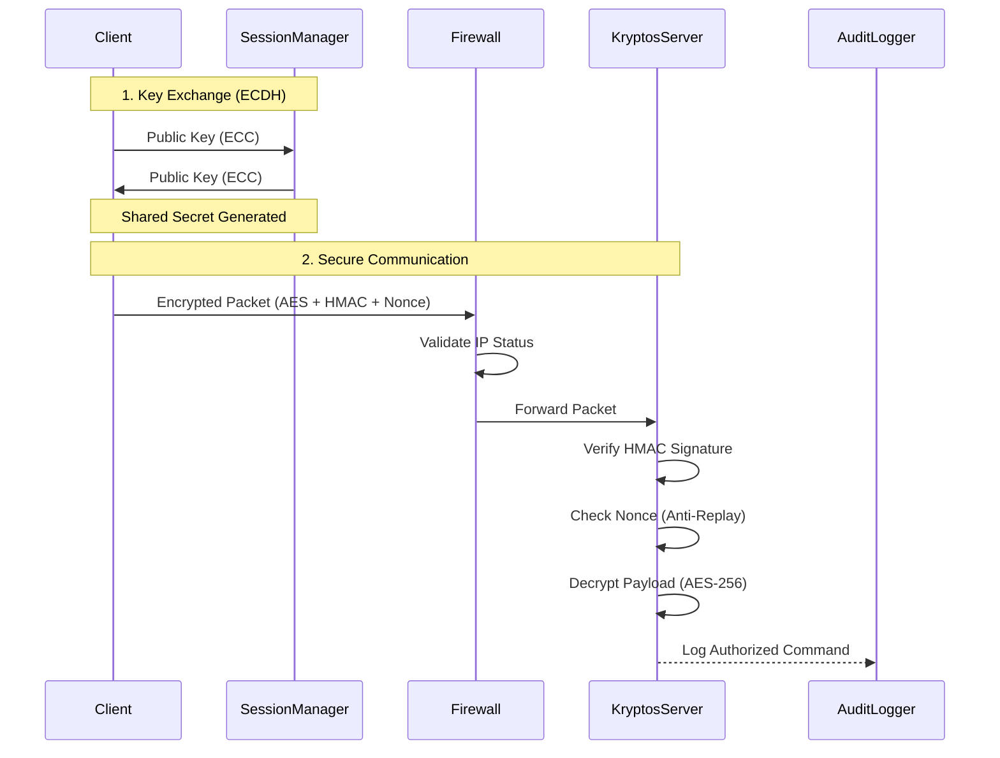

# Project: Kryptos
**Secure Command & Control Middleware**

Kryptos er et spesialisert sikkerhetslag for kritiske infrastruktursystemer. Mens tradisjonelle UDP-strømmer sender data i klartekst, sørger Kryptos for at hver datapakke er både uleselig for uvedkommende og umulig å manipulere gjennom en lagdelt forsvarsarkitektur.

## Trusselmodeller vi løser
- **Eavesdropping:** AES-256-CBC kryptering hindrer innsyn i telemetri og kommandoer.
- **Command Injection:** HMAC-SHA256 signering sikrer at kun de med validert sesjonsnøkkel kan sende instruksjoner.
- **Replay Attacks:** Integrert Nonce-validering i KryptosServer blokkerer gjenbruk av fangede pakker.
- **Key Compromise:** Ved bruk av Perfect Forward Secrecy (PFS) gjennom Diffie-Hellman, vil et tyveri av én sesjonsnøkkel ikke kompromittere tidligere eller fremtidig trafikk.
- **DoS & Brute Force:** En dynamisk FirewallEngine svartelister IP-adresser som genererer gjentatte sikkerhetsbrudd.

## Arkitektur og Flyt

## Teknisk Stack
- Java Cryptography Architecture (JCA): Brukt for alle kryptografiske primitiver.
- AES-256-CBC: Valgt for sin balanse mellom sikkerhet og ytelse i sanntidssystemer.
- HMAC-SHA256: Garanterer meldingsintegritet og autentisitet.
- ECDH (Elliptic Curve Diffie-Hellman): For sikker nøkkelutveksling over usikre kanaler.

## Hovedkomponenter

| Komponent          | Ansvar |
|--------------------|--------|
| Main.java          | Hovedinngangspunkt for applikasjonen. |
| SecurePacket.java  | Håndterer kryptering og signering av datapakker. |
| AuditLogger.java   | Logger alle autoriserte kommandoer og sikkerhetshendelser. |
| FirewallEngine.java| Dynamisk svartelisting av IP-adresser ved sikkerhetsbrudd. |
| KeyExchange.java   | Implementerer ECDH for nøkkelutveksling. |
| KryptosServer.java | Hovedserver som validerer og behandler sikre pakker. |
| SecurityProvider.java | Tilbyr kryptografiske tjenester og sikkerhetsfunksjoner. |
| SessionManager.java| Håndterer livssyklusen til nøkler og tvinger frem "Seamless Rekeying". |
| KeyGeneratorUtil.java | Verktøy for generering av kryptografiske nøkler. |
| KeyManager.java    | Administrerer lagring og tilgang til nøkler. |

### Sikkerhetsmekanismer i Praksis
Seamless Rekeying
Systemet er designet for å aldri stoppe. SessionManager overvåker sesjonstiden i bakgrunnen. Når en sesjon utløper, genereres en ny nøkkel automatisk ved neste forespørsel, noe som gjør statiske, sårbare nøkkelfiler overflødige.

Active Defense (Panic Mode)
Hvis systemet detekterer et koordinert angrep (flere ugyldige signaturer eller replay-forsøk på kort tid), kan serveren trigge en Panic Mode. Dette roterer alle master-nøkler umiddelbart og låser ned kritiske operasjoner for å minimere angrepsflaten.
